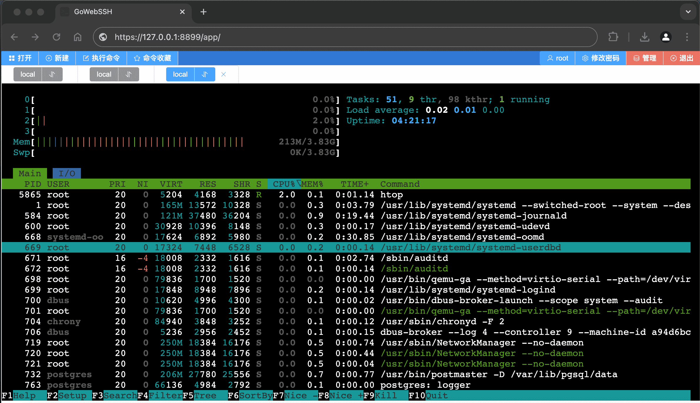
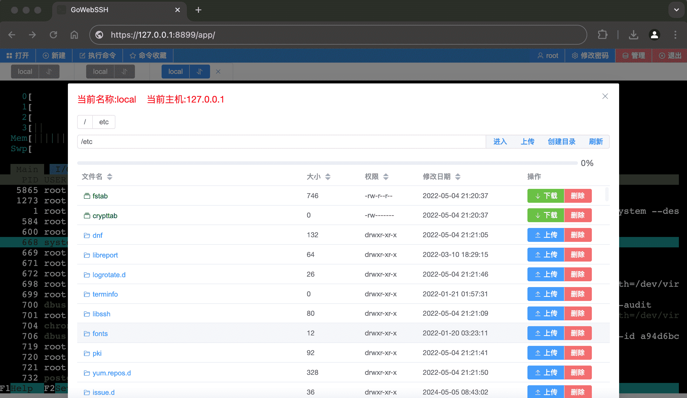
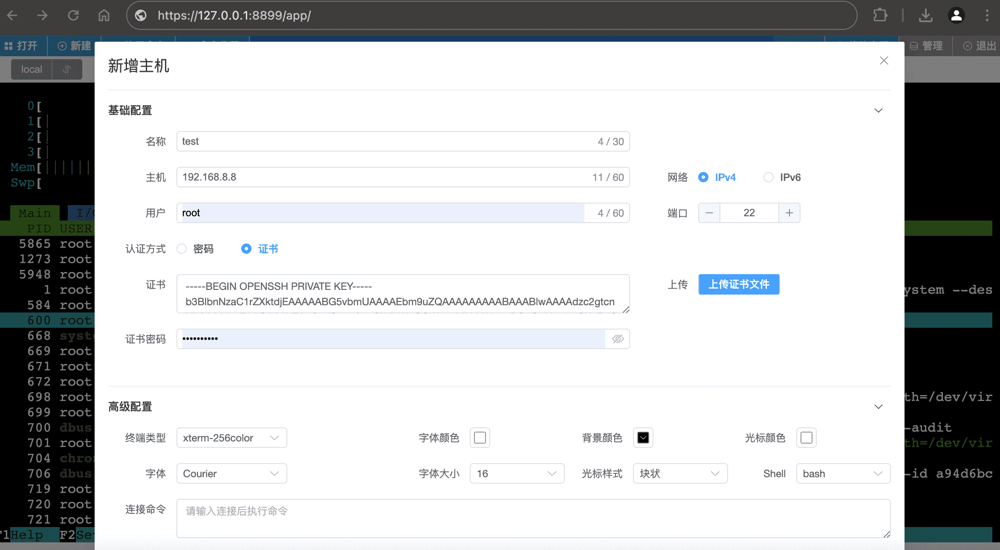

# GoWebSSH
<br/>

### 介绍：
* Golang + (Vue3 + Vite2)  实现一个Web版单文件的SSH管理工具
* 借助于Golang embed,打包以后只有一个文件,简单高效
* 使用及编译过程,超级简单,绝对保姆级
<br/>


### 目标：&nbsp;&nbsp;取代Xshell
* 目前虽然只实现xshell部分功能,未来计划逐步更新
<br/>


### 主要功能：
* 支持同时连接多个主机
* 可以保存主机连接信息
* 终端窗口大小根据浏览器窗口自适应
* 支持直接通过Web上传下载文件
* 支持自定义终端字体大小、字体颜色、字体样式
* 支持自定义背景、光标颜色及光标样式
* 支持后台管理,强制断开连接
* 已保存的主机信息可直接编辑并连接

<br/>


### 后端介绍：
* 使用最新Golang 1.17版本实现后端功能
* 实现配置文件读取功能
* 基于内存的session功能
* 借助于sqlite可把主机信息持久化
<br/>


### 前端介绍：
* 使用最新版Vue3 + TypeScript实现前端逻辑
* 前端UI使用最近element-plus最新稳定版
* 基于最新版xterm.js + Websocket 实现终端
<br/>

---
### Quick start(大象装进冰箱只需3步)：
>  必须使用golang 1.16以上版本,因为使用了Golang embed

git clone https://github.com/o8oo8o/GoWebSSH.git

cd gossh

go build

./gossh

打开链接 http://127.0.0.1:8899/ 开始享用吧

<br/>

### 为什么这么简单

* 为了方便您使用,把golang编译的依赖已经整理好了,放在lib中,clone就一起下载了

* 前端已经编译完成,并把编译完成的静态资源拷贝到gossh/webroot目录中

* 可执行文件内嵌静态资源,方便你随性所欲的移动可执行文件

* 如果你感觉好用,可以打赏我

<br/>

### 配置文件：

* 第一次运行会在用户home目录创建一个 .GoWebSSH 目录
* GoWebSSH.conf 可以配置server端口等信息
* GoWebSSH.db  是一个sqlite数据库文件,保存主机信息
* cert.pem HTTPS服务器证书文件
* key.key  HTTPS服务器私钥文件

<br/>

### 注意: 
* 当程序检测到cert.pem 和 key.key 文件,会使用https协议,否则使用http协议
* 用户只需把证书文件和私钥文件放到 .GoWebSSH 目录就可以了

<br/>

### 求助: 
* 为了方便有一个在线demo,求助一个低配版云主机

<br/>

### Systemd 方式启动: 
```shell
cat > /etc/systemd/system/gowebapp.service << "END"
##################################
[Unit]
Description=GoWebApp
After=network.target

[Service]
Type=simple
User=root

## 注:根据可执行文件路径修改
ExecStart=/usr/local/GoWebSSH

# auto restart
StartLimitIntervalSec=0
Restart=always
RestartSec=1

[Install]
WantedBy=multi-user.target
##################################
END


systemctl daemon-reload

systemctl start gowebapp.service

systemctl enable gowebapp.service

```

<br/>

---
### 演示截图：





